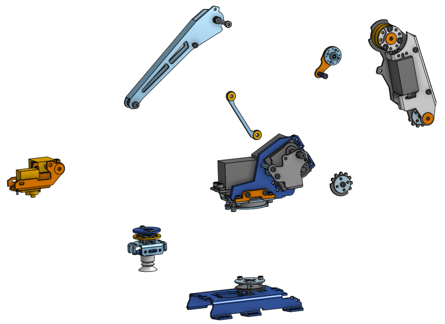
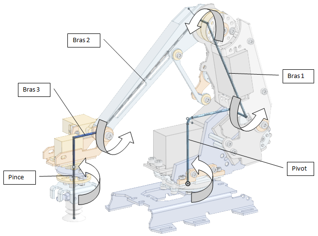
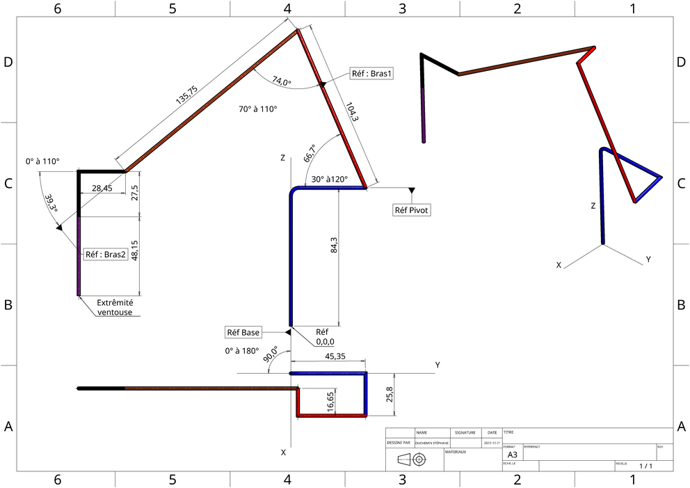

Presentation du Bras Robot
==========================

La structure du Bras Robot
--------------------------

Il s'agit d'un bras 5 axes, motorisé par des servos moteurs.

Vue éclatée
-----------

 
Orientation des 5 axes
----------------------

Squelette paramétrable du bras
------------------------------

Les dimensions du bras sont paramétrables dans l'interface graphique.
Le package python est utilisable pour d'autres bras robot avec une cinématique semblable.

